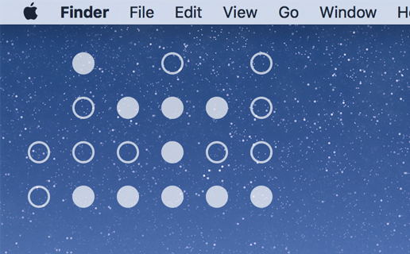

# Übersicht Binary Clock

Screenshot shows original 6 column clock while this repository uses a 3 column clock (real binary)

A simple binary clock widget built for the [Übersicht](http://tracesof.net/uebersicht/) desktop extension for Mac OSX.

Read the comments in the `index.coffee` for information on displaying 12 and 24 hour formats.
